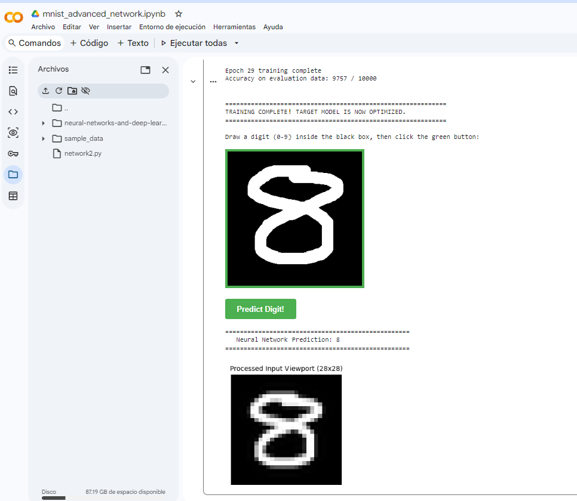

# MNIST Handwritten Digit Classifier from Scratch (Python 3)

## 🎨 Interactive Live Inference Demo

> **Visual Proof:** Here is the advanced model (`network2.py`) identifying a custom handwritten digit with high confidence:

  

The custom-built runtime canvas dynamically pipelines sketches directly into the live neural layers:
...

This repository features a complete, dual-phase deep learning laboratory focused on handwritten digit recognition using the classic MNIST dataset. The architectures and algorithms are fully refactored, modernized, and commented implementations based on the seminal work by **Michael Nielsen** in his book *Neural Networks and Deep Learning*.

## 🚀 Key Improvements & Features
* **Python 3 Migration:** Complete source code overhaul to eliminate obsolete Python 2 syntax, data-loading wrappers, and byte-decoding exceptions.
* **Dual-Stage Laboratory Evolution:** Organized sequentially across two distinct notebook workflows to visually illustrate performance enhancements.
* **Live Interactive Canvas:** Integrated a standalone, JavaScript-fueled HTML painting matrix within Google Colab allowing users to test custom handwritten digits dynamically using mathematical resizing filters (Lanczos interpolation and dynamic bounding-box auto-centering).

---

## 📂 Repository Structure

* 📁 `mnist_classic_network.ipynb` -> Phase 1: Notebook deploying a basic Stochastic Gradient Descent (SGD) neural framework.
* 📁 `network.py` -> Core engine script for the Phase 1 Quadratic Cost architecture.
* 📁 `mnist_advanced_network.ipynb` -> Phase 2: Notebook applying cutting-edge initialization, regularizations, and loss equations.
* 📁 `network2.py` -> Premium engine script implementing Cross-Entropy tracking and L2 Regularization mechanics.

---

## 📊 Technical Evolution & Comparison

### Phase 1: The Classic Framework (`network.py`)
* **Core Metrics:** Reached a baseline validation accuracy of ~95.0% over 30 epochs.
* **Limitations:** Faced slight learning stagnation during early epochs due to derivative saturation under the Quadratic Cost function (Mean Squared Error).

### Phase 2: The Advanced Model (`network2.py`)
* **Core Metrics:** Achieved an outstanding **97.92% accuracy** within the same training window.
* **Cross-Entropy Cost:** Algebraically bypassed neuron learning slowdowns. The network now optimizes at maximum acceleration precisely when its predictions are highly inaccurate.
* **L2 Regularization (Weight Decay):** Introduced a dynamic penalty constraint (`lmbda = 5.0`) forcing the matrix weights to stay small and evenly distributed. This drastically mitigates **Overfitting**, enabling the model to learn abstract geometries instead of memorizing training instances.

---

## 🎨 Interactive Live Inference Demo

The custom-built runtime canvas dynamically pipelines sketches directly into the live neural layers:

1. **User Input:** Raw coordinate matrix drawn on a 280x280 black HTML grid.
2. **Preprocessing Pipeline:** Bounding box cropping -> Proportional 25% boundary padding -> Lanczos downsampling to 28x28 grayscale vector space -> [0.0, 1.0] intensity normalization.
3. **Inference Processing:** Forward-pass execution mapping structural activations to discrete numerical nodes.

---

## 📜 Credits and Acknowledgments
This educational project is built upon the foundational textbooks and code repository published by **Michael Nielsen**. Special thanks to his documentation for providing deep insights into the mathematical mechanics of backpropagation.
